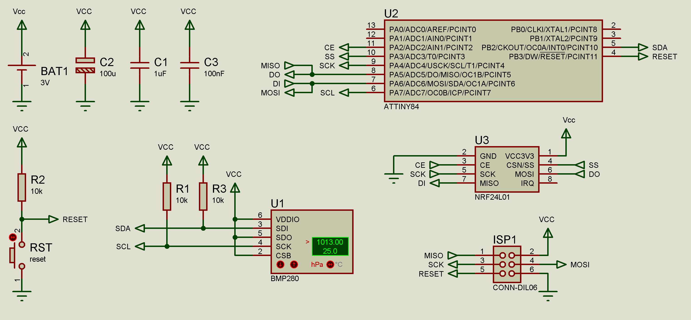
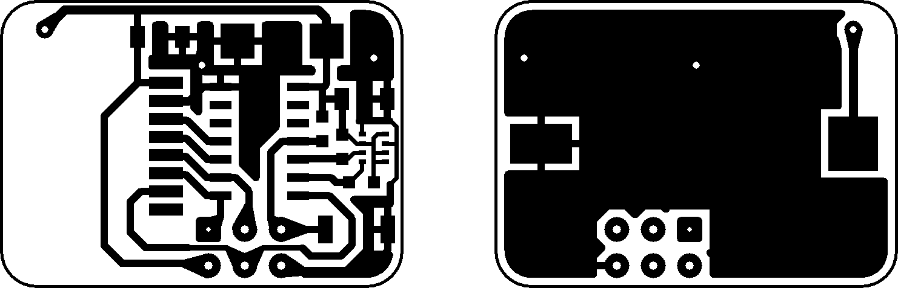
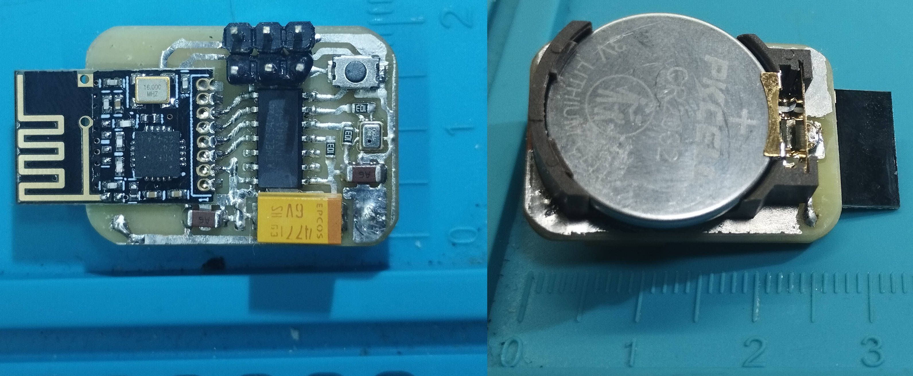

# TinySensor: Low-Power Wireless Temperature and Pressure Sensor

## Overview

TinySensor is a compact, battery-powered sensor designed for smart home applications. It measures temperature and atmospheric pressure using the BMP280 sensor, communicates wirelessly via the NRF24L01+ module, and integrates seamlessly with Home Assistant through MQTT discovery. The device runs on an ATtiny84 microcontroller and is powered by a single CR2032 battery, which supports operation in sub-zero temperatures. 

The sensor sends periodic updates (temperature, pressure, battery voltage, and battery level) to an MQTT broker via a compatible gateway (e.g., [RF24Gateway](https://github.com/Tsukihime/RF24Gateway)). It features ultra-low power consumption for long battery life, with configurable settings stored in EEPROM.

The PCB is designed to be extremely small (28mm x 20mm, extending to 35mm with the NRF antenna) while remaining feasible for home fabrication.

## Features

- **Sensors**: BMP280 for temperature (±0.5°C accuracy) and pressure (±1 hPa accuracy).
- **Wireless Communication**: NRF24L01+ SMD module for low-power RF transmission.
- **Battery Monitoring**: Measures battery voltage using the ATtiny84's internal bandgap reference and calculates battery percentage.
- **MQTT Integration**: Publishes data to MQTT topics and supports Home Assistant auto-discovery.
- **Low Power Design**: Sleeps in power-down mode, waking via watchdog timer. Update interval: every 5 minutes; device identification: every 12 hours; startup delay: 3 minutes.
- **Configurable Settings**: EEPROM stores device ID, bandgap voltage (for accurate battery readings), and NRF transmit power level. Defaults are applied on first boot.
- **Unique ID Generation**: Automatically generates a 6-character hexadecimal ID based on entropy (temperature, pressure, voltage, OSCAL, and BMP280 calibration data) if not preset.
- **Compact Size**: 28mm x 20mm PCB (35mm with antenna protrusion).
- **Battery**: CR2032 (3V lithium coin cell), suitable for wide temperature ranges including negative temperatures.

## Hardware Components

- ATtiny84 microcontroller
- BMP280 pressure/temperature sensor (I2C address: 0x77)
- NRF24L01+ SMD wireless module
- CR2032 battery holder
- Miscellaneous passives (resistors, capacitors) as per schematic

## Schematic and PCB

- **Schematic**: 
- **PCB Layout** (600 DPI): 

The design prioritizes minimal size and ease of home etching/assembly.

## Assembled Device Photo



## Setup and Installation

### Firmware Compilation and Flashing

1. Install Microchip Studio for an integrated development environment.
2. The project includes a solution file `TinySensor.atsln` for Microchip Studio, which can be opened directly to compile the firmware.
3. Compile the firmware to generate a HEX file.
4. Flash the compiled HEX file to the ATtiny84 using an AVR programmer.

On first boot, the device will initialize default EEPROM settings:
- Magic: 0xC0DE
- Bandgap: 1100 mV (reference voltage for battery measurement)
- Transmit Power: MAX (RF24_PA_MAX)
- Device ID: Auto-generated 6-character hex string

### Fuse Bits Configuration

The ATtiny84 fuse bits are modified from defaults to preserve EEPROM during chip erase (EESAVE enabled) and reduce startup delay (SUT bits adjusted).

- **Low Fuse**: 0x42
- **High Fuse**: 0xD7
- **Extended Fuse**: 0xFF
- **Lock Fuse**: 0xFF

Use an AVR programmer (e.g., USBasp) and tools like AVRdude to set these. Verify with the [AVR Fuse Calculator](https://eleccelerator.com/fusecalc/fusecalc.php?chip=attiny84&LOW=42&HIGH=D7&EXTENDED=FF&LOCKBIT=FF).

Example AVRdude command:
```
avrdude -c usbasp -p t84 -U lfuse:w:0x42:m -U hfuse:w:0xD7:m -U efuse:w:0xFF:m
```

### Custom EEPROM Settings (Optional)

Use the provided Python script `eeprom_settings_generator.py` to create a custom `.eep` file for EEPROM programming. This allows fine-tuning:
- Bandgap voltage (0–65535, default: 1100) for accurate battery voltage measurement.
- NRF transmit power (MIN=0, LOW=1, HIGH=2, MAX=3; default: MAX).
- Device ID (exactly 6 ASCII characters).

Run the script interactively:
```
python eeprom_settings_generator.py
```

It generates an Intel HEX file (e.g., `settings_1100_ABCDEF_MAX.eep`). Flash it to EEPROM:
```
avrdude -c usbasp -p t84 -U eeprom:w:settings_1100_ABCDEF_MAX.eep:i
```

### Gateway Integration

The sensor communicates with an NRF24 gateway. Use [RF24Gateway](https://github.com/Tsukihime/RF24Gateway) or a compatible setup to forward data to your MQTT broker (e.g., for Home Assistant).

- Gateway Address: "NrfMQ"
- Channel: 0x6F
- Data Rate: 1 Mbps
- CRC: 16-bit
- Auto-Ack: Enabled

MQTT Topics:
- State: `home/sensor_<DEVICE_ID>` (JSON payload: `{"t": temperature, "p": pressure (hPa), "v": voltage (mV), "b": battery (%)}`)
- Discovery: `homeassistant/device/<DEVICE_ID>/config` (sent periodically for Home Assistant auto-configuration)

## Usage

1. Assemble the hardware as per the schematic and PCB.
2. Flash firmware and fuses.
3. Optionally, flash custom EEPROM settings.
4. Insert CR2032 battery.
5. The device will start measuring and transmitting after the initial delay.
6. Ensure the gateway is running and connected to your MQTT broker.

Battery life depends on update frequency and transmit power; expect months of operation on a single CR2032.

## Dependencies

- BMP280 library (included in source)
- RF24 library (included in source)
- Compatible NRF24 MQTT gateway: [RF24Gateway](https://github.com/Tsukihime/RF24Gateway)

## License

This project is open-source under the MIT License. See LICENSE file for details.